# Procesverslag
Markdown is een simpele manier om HTML te schrijven.  
Markdown cheat cheet: [Hulp bij het schrijven van Markdown](https://github.com/adam-p/markdown-here/wiki/Markdown-Cheatsheet).

Nb. De standaardstructuur en de spartaanse opmaak van de README.md zijn helemaal prima. Het gaat om de inhoud van je procesverslag. Besteedt de tijd voor pracht en praal aan je website.

Nb. Door *open* toe te voegen aan een *details* element kun je deze standaard open zetten. Fijn om dat steeds voor de relevante stuk(ken) te doen.

## Jij

uitwerken voor kick-off werkgroep

### Auteur:
Sophie Bouman

#### Je startniveau:
Blauwe piste

#### Je focus:
Responsive
 

## Je website

uitwerken voor kick-off werkgroep

### Je opdracht:
https://www.seekdiscomfort.com/

#### Screenshot(s) van de eerste pagina (small screen): 
hier de naam van de pagina  
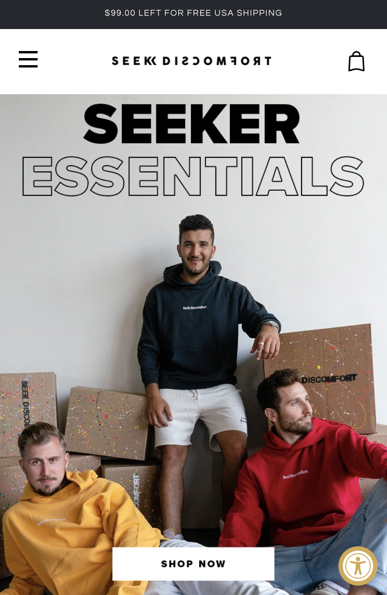
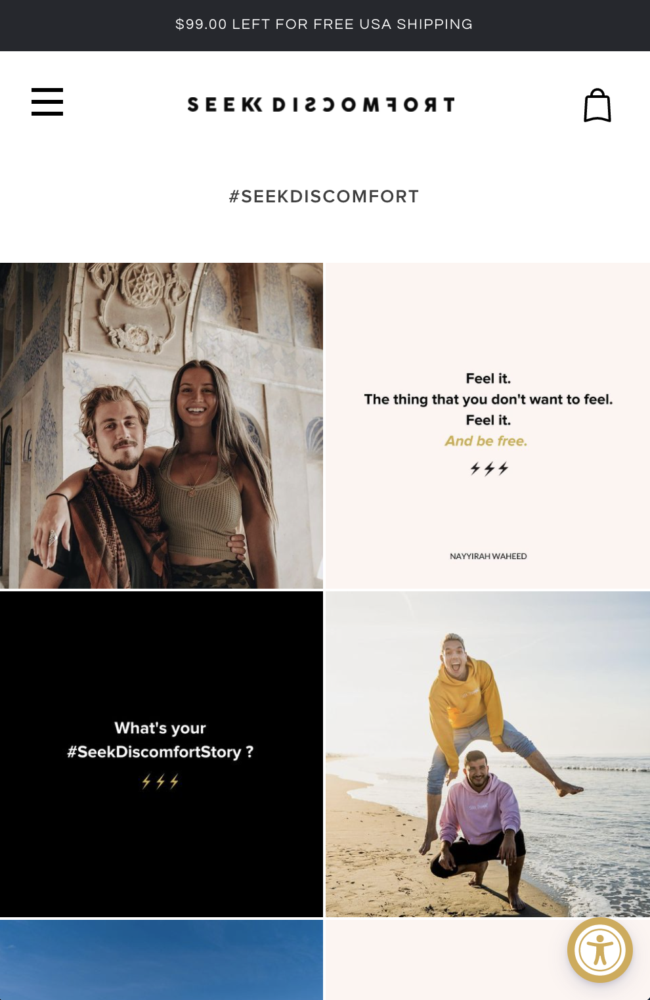

#### Screenshot(s) van de tweede pagina (small screen):
hier de naam van de pagina  
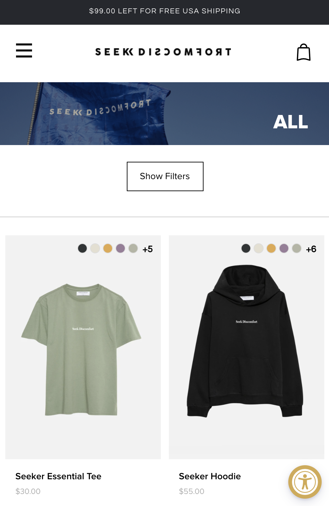
 

## Breakdownschets (week 1)

uitwerken na afloop 2e werkgroep

### de hele pagina: 
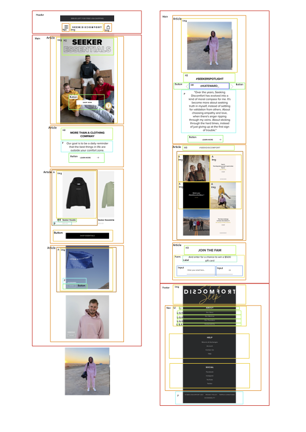
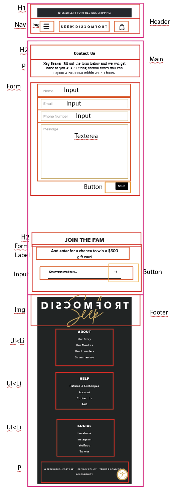

### dynamisch deel (bijv menu): 

### wellicht nog een dynamisch deel (bijv filter): 
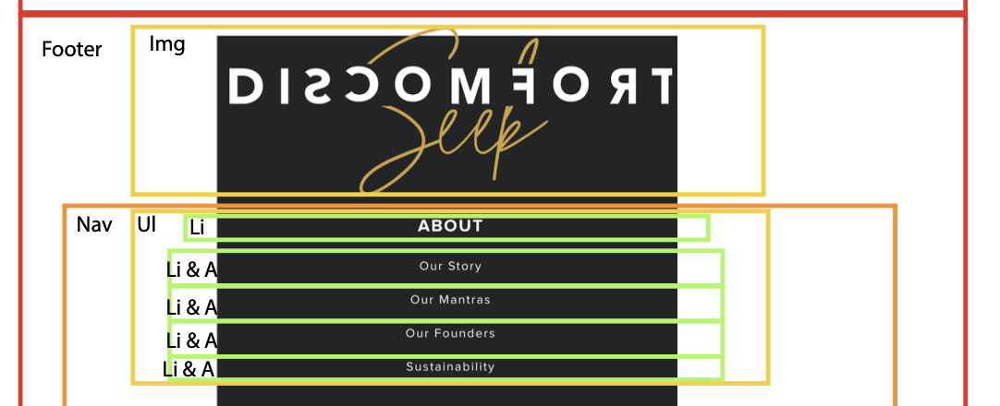

## Voortgang 1 (week 2)

uitwerken voor 1e voortgang

### Stand van zaken
Ik voel me gemotiveerd, alleen heb ik nog niet veel gemaakt. Ik heb bijna alle HTML af van de eerste pagina en heb nog geen css toegevoegd.

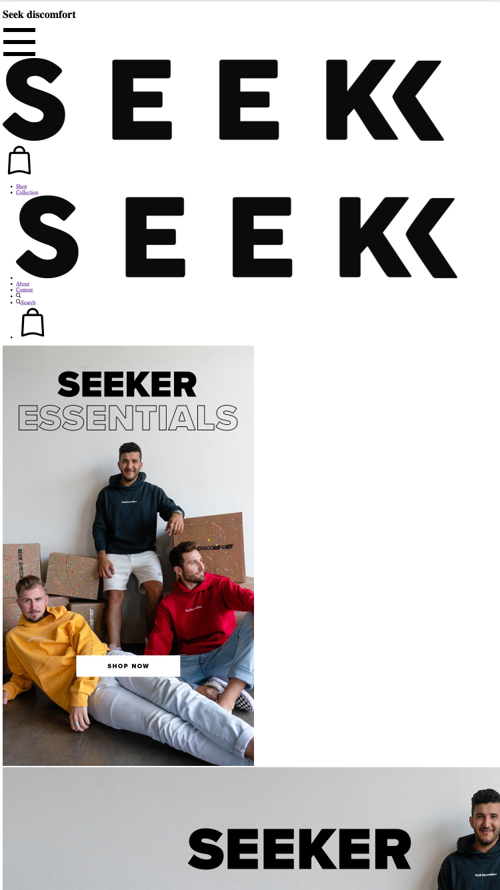
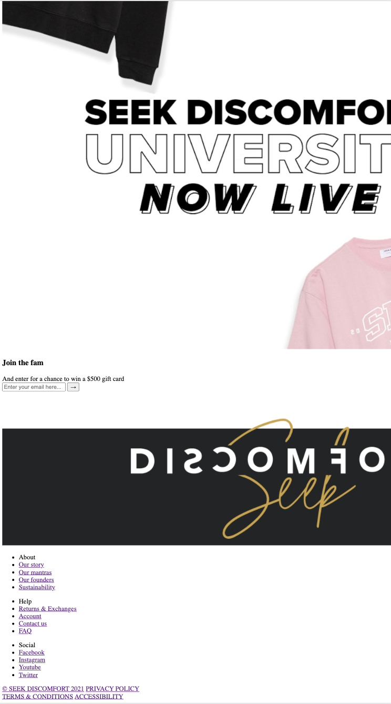
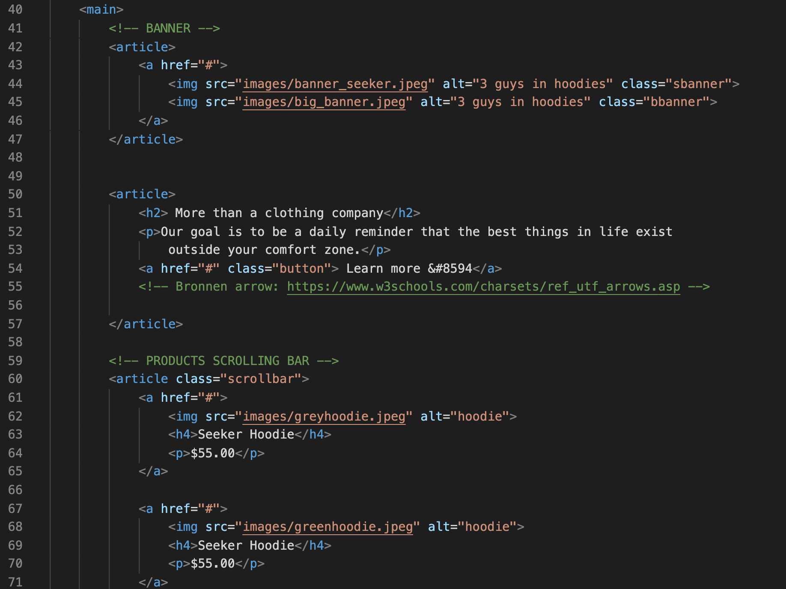

### Agenda voor meeting
samen met je groepje opstellen

| student 1      | student 2          | student 3    | student 4        |
| ---            | ---                | ---          | ---              |
| dit bespreken  | en dit             | en ik dit    | en dan ik dat    |
| en dat ook nog | dit als er tijd is | nog een punt | dit wil ik zeker |
| ...            | ...                | ...          | ...              |

### Verslag van meeting
hier na afloop snel de uitkomsten van de meeting vastleggen

Ik moet beter gebuik maken van comments om te laten ziet wat waar voor staat en ik was vergeten om een <nav>
om mijn navigatie te zetten. De rest van de HTML zag er goed uit. De feedback is makkelijk te verwerken dus ik kan gewoon door met mijn HTML af schrijven en css toevoegen.

## Voortgang 2 (week 3)

uitwerken voor 2e voortgang

### Stand van zaken
Ik heb mijn html nu zo goed als af, ik moet nog een paar dingen verbeteren na de feedbackgesprekken. Ik ben al begonnen met mijn css, maar ik heb wel er wel een beetje moeite mee, vooral met hoe je bepaalde dingen aanspreekt. Het vooral weer veel googlen om weer te snappen hoe het allemaal precies werkte. Ik vind de navigatie balk ook een erge uitdaging, maar ik ben van plan om nog eens goed te gaan kijken naar de pencode opdracht waar je ook een responsiv menu kan maken.

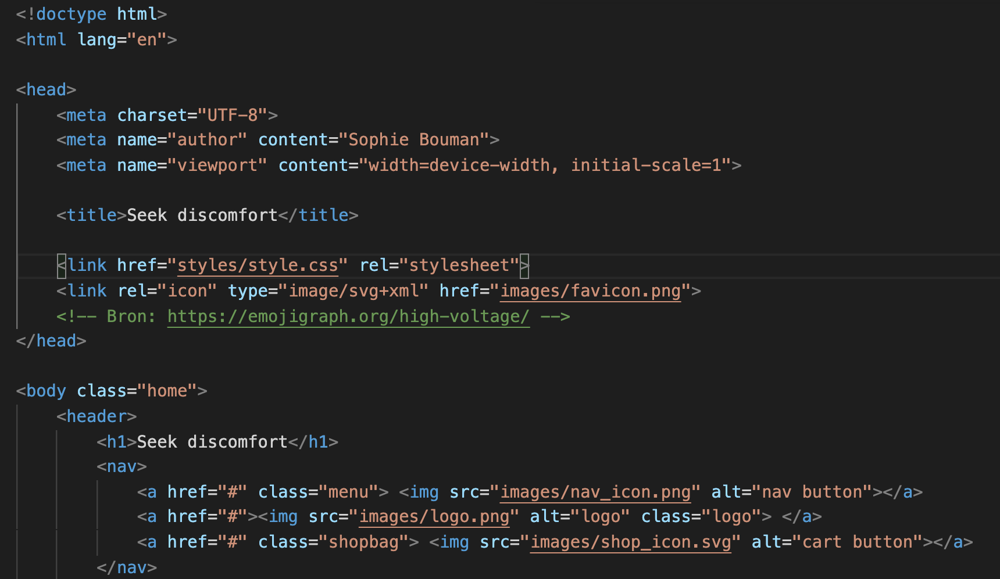
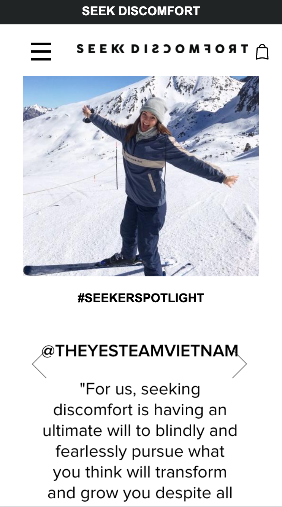

### Agenda voor meeting
samen met je groepje opstellen

| student 1      | student 2          | student 3    | student 4        |
| ---            | ---                | ---          | ---              |
| dit bespreken  | en dit             | en ik dit    | en dan ik dat    |
| en dat ook nog | dit als er tijd is | nog een punt | dit wil ik zeker |
| ...            | ...                | ...          | ...              |

### Verslag van meeting
Ik moet een paar dingen nog toe gaan voegen. Ik was namelijk vergeten mijn naam bovenaan zetten in de HTML. Op de website die ik na ga maken zijn sliders te vinden van instagram posts en omdat het best wel lastig is om het na te maken mag ik statische afbeelding gebruiken voor de sliders. In de <a> stond een href die leeg was, nu weet ik dat er een # moet staan als je wilt dat het nergens heen gaat. Bij de label wist ik niet zo goed wat ik moest invullen bij for="" en ik weet nu dat ik daar het zelfde moet zetten als wat ik bij de input heb.
Er waren ook nog een paar dingen die ik moest veranderen. Ik heb buttons gebruikt die naar andere pagina zouden moeten gaan, maar dat moet een a zijn.

Er werd gevraagd wat het verschil tussen een article en een section was, want ik had gebruik gemaakt van allebij en ik wist het niet meer zo goed, maar het is me weer uitgelegd. Een section is voor als je elementen groepeerd en arcticles zijn echt los van elkaar.

Een van de belangrijke punten was dat ik mijn procesverslag moet bijwerken, want ik ben nog niet bezig geweest met het uitschrijven van de feedback punten en ik heb nog niet alle foto's toegevoegd.

## Toegankelijkheidstest (week 4)

uitwerken na test in 8e voortgang

### Bevindingen
Lijst met je bevindingen die in de test naar voren kwamen:
- Je kan niet met alleen je toetsenbord als besturing naar de menubalk gaan
- Grijze tekst met een witte achtergrond is iets moeilijker te lezen

#### Titel eerste bevinding
Als je gebruik maakt van tabs, dan wordt de navigatie overgeslagen en dat zorgt ervoor dat het niet meer toegangelijk is voor iedereen.
Ik heb uiteindelijk alle code nagekeken en over een a omheen gezet met een # bij de href en daarna deed hij het wel.

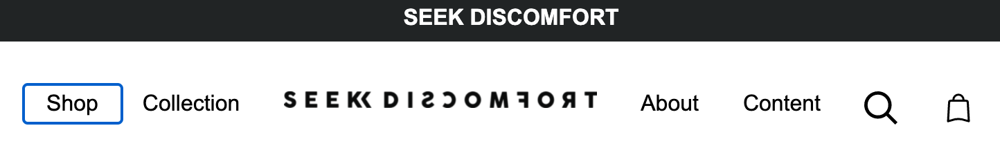

#### Titel tweede bevinding. 
Het contrast van grijze tekst op een witte achtergrond is niet zo duidelijk voor sommige slecht ziende mensen.
Ik heb het opgelost door de kleur door een donkerdere versie van grijs te vervangen.

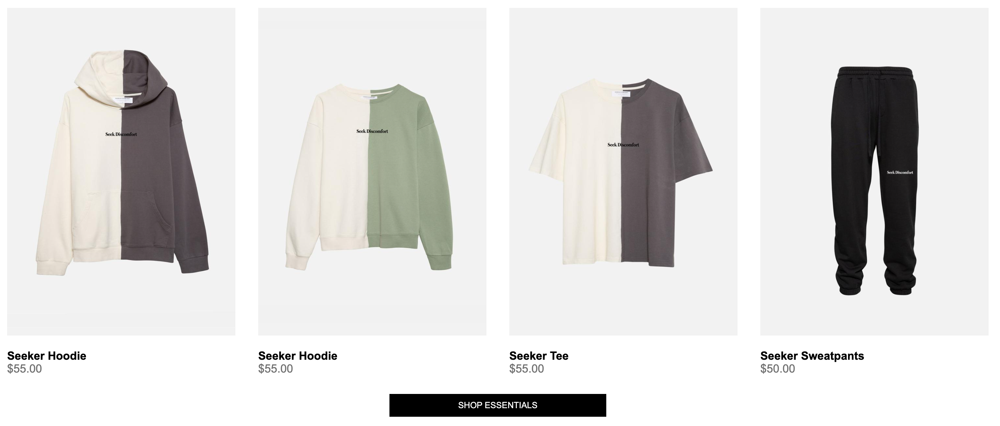

## Voortgang 3 (week 4)

uitwerken voor 3e voortgang

### Stand van zaken
Mijn eerste pagina is zo goed als af. De menu balk werkt nog steeds niet precies zo als het zou moeten, dus dat vind ik nog best wel lastig. Ik was dus begonnen aan mijn tweede pagina, maar aangezien je 1 css bestand mag gebruiken kost het me ook veel tijd om ervoor te zorgen dat ik de juiste element op de juiste pagina aanspreek.

### Agenda voor meeting
samen met je groepje opstellen

| student 1      | student 2          | student 3    | student 4        |
| ---            | ---                | ---          | ---              |
| dit bespreken  | en dit             | en ik dit    | en dan ik dat    |
| en dat ook nog | dit als er tijd is | nog een punt | dit wil ik zeker |
| ...            | ...                | ...          | ...              |

### Verslag van meeting
Ik loop nog steeds achter, dus de student assistent zei dat ik me vooral moest focussen op de tweede pagina, de navigatie balk, het procesverslag en de css ordenen. Ik had nog vragen over hoe  ik de scrollbar onzichtbaar kan maken bij die horizontale scrollbar, dus ze stuurde een stuk code door:
::-webkit-scrollbar {
  display: none;
}
Helaas werkte het niet, maar hij zei dat het ook niet erg zou zijn om het zo te laten.

## Eindgesprek (week 5)

uitwerken voor eindgesprek

### Stand van zaken
hier dit ging goed & dit was lastig (neem ook screenshots op van delen van je website en code)

### Screenshot(s)

hier screenshot(s) van je eindresultaat

## Bronnenlijst

continu bijhouden terwijl je werkt

Nb. Wees specifiek ('css-tricks' als bron is bijv. niet specifiek genoeg).

1. https://css-tricks.com/snippets/css/a-guide-to-flexbox/
2. https://css-tricks.com/snippets/css/complete-guide-grid/
3. https://www.w3schools.com/charsets/ref_utf_arrows.asp
4. https://emojigraph.org/high-voltage/

